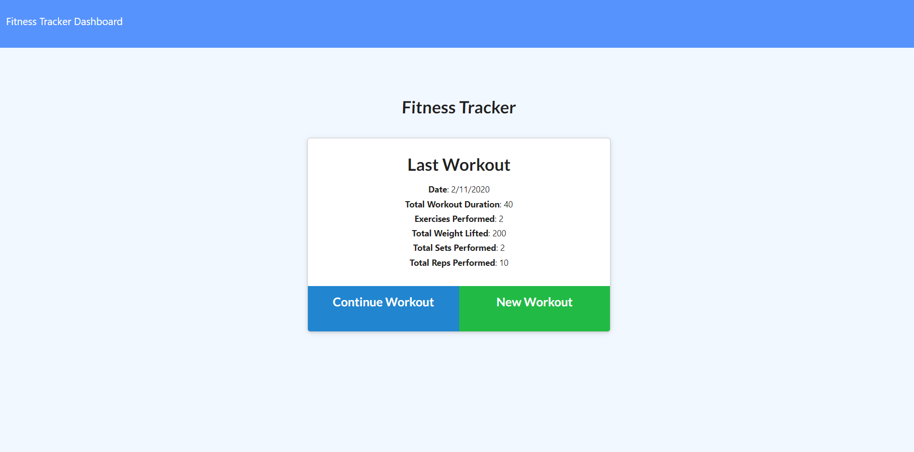

# Workout-Tracker

* For this assignment, you'll create a workout tracker. You have already been provided with the front end code in the `Develop` folder. This assignment will require you to create Mongo database with a Mongoose schema and handle routes with Express.

## Description
* When the user loads the page, they should be given the option to create a new workout, or continue with their last workout.

The user should be able to:

  * Add exercises to a previous workout plan.

  * Add new exercises to a new workout plan.

  * View multiple the combined weight of multiple exercises on the `stats` page.

## Reocurring Problems
* Since most of the work was done on the routes, making sure that the paths were set correctly was a big part of the assignment.

* Sometimes I would run the app and the links would not work because the paths to the other html pages were not set right.

* The good thing about it was that it would show on the browser that there was no such file on the path provided, letting me go back and try to change the paths.

* I also forgot to require the routes in the app.use setup and so it was giving me an error that there was no middleware setup for it.

## screenshots
* This is the initial page

* This is how the stats looks

* The page to continue an excersise

* Page where user can create an excersise

## Final Thoughts
* This app was a great way to see how to work well with routes.

* Making this deploy with heroku, I had to make sure the database was changed to be able to work with heroku.

* connecting the databased was a lot of work and took a lot of tries to make it load the seed file.

* Heroku is a great way to see how you are going to work when having to change the setup for connecting your databased if they change.